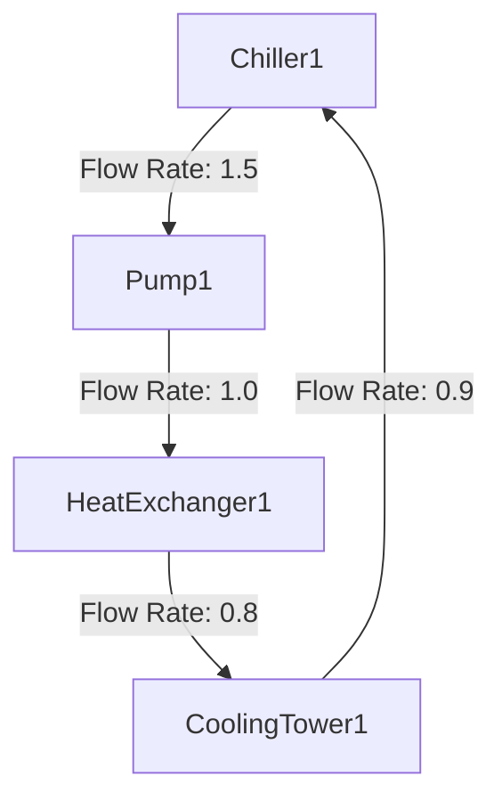
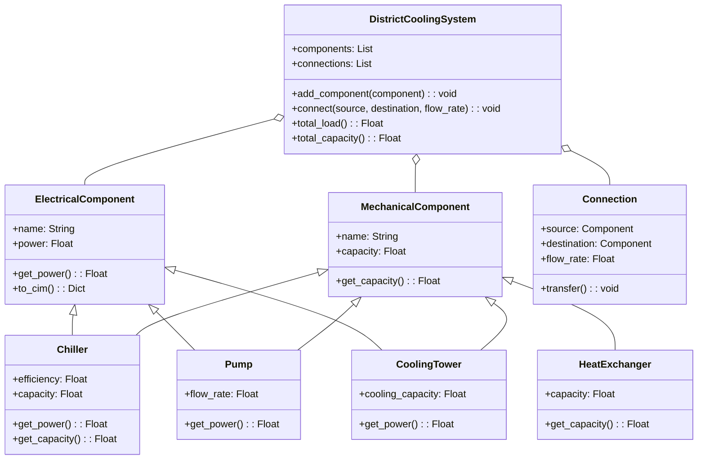

# Electrical Load Simulation System

## Overview

This document describes a class/object system in Python that defines and simulates both electrical and mechanical components of a district cooling system. The system allows users to create various types of loads, integrate these loads into larger systems, and analyze overall performance. The data model follows the Common Information Model (CIM) standard.

## Class Structure

### Base Class: ElectricalComponent

The `ElectricalComponent` class serves as the foundation for all types of electrical components and is compatible with SimPy for simulation.

```python
# electrical_component.py
import simpy

class ElectricalComponent:
    def __init__(self, env, name, power):
        self.env = env
        self.name = name
        self.power = power
        self.process = env.process(self.run())

    def run(self):
        while True:
            print(f"{self.name} operating at {self.power} kW at time {self.env.now}")
            yield self.env.timeout(1)

    def get_power(self):
        return self.power
```

### Base Class: MechanicalComponent

The `MechanicalComponent` class serves as the foundation for all types of mechanical components.

```python
# mechanical_component.py
class MechanicalComponent:
    def __init__(self, name, capacity):
        self.name = name
        self.capacity = capacity

    def get_capacity(self):
        return self.capacity
```

### Connection Class

The `Connection` class represents a link between two components, facilitating the simulation of resource transfer.

```python
# connection.py
class Connection:
    def __init__(self, source, destination, flow_rate=1.0):
        self.source = source
        self.destination = destination
        self.flow_rate = flow_rate or (source.flow_rate if isinstance(source, Pump) else 1.0)

    def transfer(self):
        print(f"Transferring from {self.source.name} to {self.destination.name} at flow rate {self.flow_rate}")
```

### Derived Classes

#### Chiller

The `Chiller` class extends both `ElectricalComponent` and `MechanicalComponent`, introducing an `efficiency` attribute for electrical aspects and a `capacity` attribute for mechanical aspects. The electrical load is dynamically calculated based on the mechanical capacity and efficiency.

```python
# chiller.py
from electrical_component import ElectricalComponent
from mechanical_component import MechanicalComponent

class Chiller(ElectricalComponent, MechanicalComponent):
    def __init__(self, env, name, efficiency, capacity):
        MechanicalComponent.__init__(self, name, capacity)
        power = self.calculate_power(efficiency, capacity)
        ElectricalComponent.__init__(self, env, name, power)
        self.efficiency = efficiency

    def calculate_power(self, efficiency, capacity):
        return capacity * efficiency

    def get_power(self):
        self.power = self.calculate_power(self.efficiency, self.capacity)
        return self.power
```

#### Pump

The `Pump` class extends both `ElectricalComponent` and `MechanicalComponent`, introducing a `flow_rate` attribute.

```python
# pump.py
from electrical_component import ElectricalComponent
from mechanical_component import MechanicalComponent

class Pump(ElectricalComponent, MechanicalComponent):
    def __init__(self, env, name, power, flow_rate, capacity):
        MechanicalComponent.__init__(self, name, capacity)
        ElectricalComponent.__init__(self, env, name, power)
        self.flow_rate = flow_rate

    def get_power(self):
        return self.power * self.flow_rate
```

#### Heat Exchanger

The `HeatExchanger` class extends `MechanicalComponent` and introduces a `capacity` attribute.

```python
# heat_exchanger.py
from mechanical_component import MechanicalComponent

class HeatExchanger(MechanicalComponent):
    def __init__(self, name, capacity):
        super().__init__(name, capacity)
```

#### Cooling Tower

The `CoolingTower` class extends both `ElectricalComponent` and `MechanicalComponent`, introducing a `cooling_capacity` attribute.

```python
# cooling_tower.py
from electrical_component import ElectricalComponent
from mechanical_component import MechanicalComponent

class CoolingTower(ElectricalComponent, MechanicalComponent):
    def __init__(self, env, name, power, cooling_capacity):
        MechanicalComponent.__init__(self, name, cooling_capacity)
        ElectricalComponent.__init__(self, env, name, power)
        self.cooling_capacity = cooling_capacity

    def get_power(self):
        return self.power * self.cooling_capacity
```

### System Class: DistrictCoolingSystem

The `DistrictCoolingSystem` class manages multiple components and their connections, calculating the total electrical load and capacity using composition.

```python
# district_cooling_system.py
from connection import Connection

class DistrictCoolingSystem:
    def __init__(self, env, name):
        self.env = env
        self.name = name
        self.components = []
        self.connections = []

    def add_component(self, component):
        self.components.append(component)

    def connect(self, source, destination, flow_rate=1.0):
        connection = Connection(source, destination, flow_rate)
        self.connections.append(connection)

    def total_load(self):
        return sum(component.get_power() for component in self.components if isinstance(component, ElectricalComponent))

    def total_capacity(self):
        return sum(component.get_capacity() for component in self.components if isinstance(component, MechanicalComponent))

    def run(self):
        while True:
            for connection in self.connections:
                connection.transfer()
            total_power = self.total_load()
            total_capacity = self.total_capacity()
            print(f"Total system load: {total_power} kW, Total capacity: {total_capacity} at time {self.env.now}")
            yield self.env.timeout(1)
```

### Example Usage

```python
# example_usage.py
import simpy
from chiller import Chiller
from pump import Pump
from heat_exchanger import HeatExchanger
from cooling_tower import CoolingTower
from district_cooling_system import DistrictCoolingSystem

if __name__ == "__main__":
    env = simpy.Environment()

    chiller1 = Chiller(env, "Chiller1", 0.9, 500)
    pump1 = Pump(env, "Pump1", 50, 1.2, 300)
    heat_exchanger1 = HeatExchanger("HeatExchanger1", 400)
    cooling_tower1 = CoolingTower(env, "CoolingTower1", 40, 0.85)

    system = DistrictCoolingSystem(env, "DistrictCoolingSystem")
    system.add_component(chiller1)
    system.add_component(pump1)
    system.add_component(heat_exchanger1)
    system.add_component(cooling_tower1)

    # Define connections
    system.connect(chiller1, pump1)
    system.connect(pump1, heat_exchanger1)  # Flow rate determined by pump1
    system.connect(heat_exchanger1, cooling_tower1, flow_rate=0.8)
    system.connect(cooling_tower1, chiller1, flow_rate=0.9)  # Example of a loop

    env.process(system.run())
    env.run(until=10)
```

### Graph of Connections

Below is a graph that visually represents the connections in the example:



## Class Interactions

You can combine the classes within the Electrical Load Simulation System to model a comprehensive electrical load system. Each class represents a specific type of electrical or mechanical component, and you can integrate these to form a larger system. For instance, a building's electrical load system might include chillers, pumps, heat exchangers, cooling towers, lighting, and HVAC units. By combining these classes, you can simulate the overall power consumption and performance of the building's electrical system.



## Conclusion

This document provides a framework for creating and simulating both electrical and mechanical components in Python. By adhering to the CIM standard, you can seamlessly integrate the system with other power system models for comprehensive analysis. The introduction of a connection-based approach allows for detailed simulation of interactions between components, enhancing the system's flexibility and realism.